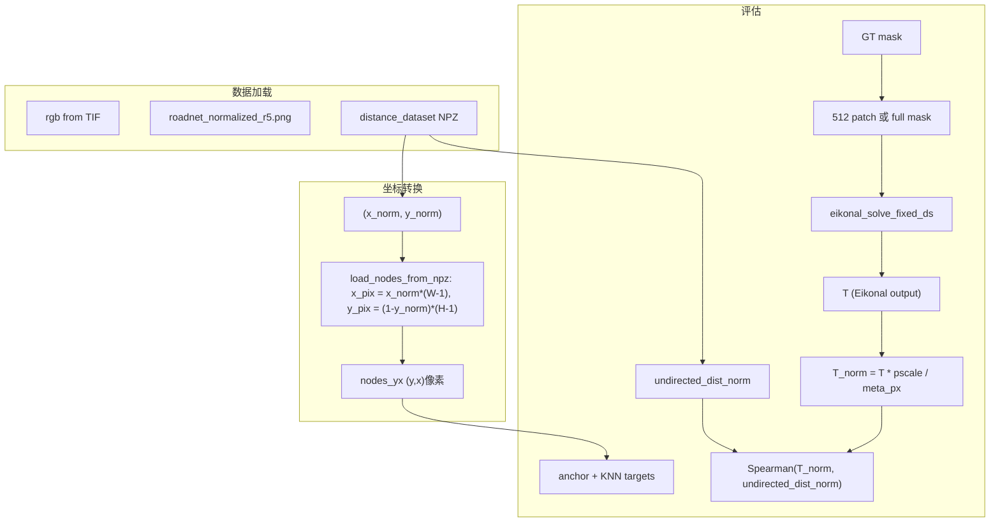

# GT Spearman 未达 1.0 诊断计划

## 问题描述

使用 GT 道路分割图时，理论上若能找到每对节点的真实最短路，Spearman 应接近 1.0。若未达 1.0，可能原因包括：数据加载错误、mask/TIF 对齐问题、ROI 过小导致 truncation、Eikonal 迭代不足、或单位/归一化不一致。

---

## 数据流概览




---

## 一、数据导入与对齐验证

### 1.1 Mask 与 TIF 尺寸一致性

**风险**: `roadnet_normalized_r5.png` 可能与 `crop_*.tif` 尺寸不一致（如全区域 vs 单 crop），导致 mask 被错误插值。

**验证位置**: [test_gt_ablation2.py](eikonal_solver/test_gt_ablation2.py) 约 684-688 行

**建议检查**:

- 在 `load_gt_mask` 返回后，断言 `m.shape == (H_orig, W_orig)`，不匹配时明确报错
- 若 mask 原始尺寸与 TIF 不同，需要按 TIF 的 geo-extent 裁剪/对齐，而非简单 resize

### 1.2 NPZ 坐标与图像坐标系

**关键代码**: [dataset.py](eikonal_solver/dataset.py) 1169-1177 行

```python
x_pix = np.rint(x_norm * (W - 1)).astype(np.int64)   # x_norm in [0,1]
y_pix = np.rint((1.0 - y_norm) * (H - 1)).astype(np.int64)  # y_norm bottom-up
```

- `load_nodes_from_npz` 使用 `road_prob.shape` 的 H、W（来自 `rp_dummy`，即 H_orig、W_orig）
- NPZ 中 `meta_sat_height_px`、`meta_sat_width_px` 应与 TIF 一致；若不一致会导致节点落在错误像素

**建议**:

- 增加断言：`assert (meta_sat_height_px, meta_sat_width_px) == (H_orig, W_orig)`
- 打印若干节点的 `(x_norm, y_norm)` 与 `(y_pix, x_pix)` 以目视核对是否落在道路上

### 1.3 undirected_dist_norm 含义

- `undirected_dist_norm = d_meters / meta_distance_ref_m`（约等于 path_pixels / H）
- 典型范围约 [0, 1]
- 用于 Spearman 时仅需与 `T_norm` 保持单调关系，尺度不必完全一致

---

## 二、ROI 与 Truncation 问题

### 2.1 Legacy 512-patch 模式的 ROI 截断

**位置**: [test_gt_ablation2.py](eikonal_solver/test_gt_ablation2.py) 207-239 行

```python
span_max = int(torch.max(torch.abs(tgt_yx.float() - anc_yx.float())).item())
half = span_max + margin   # margin=64
P = max(2 * half + 1, 64)  # ROI 边长
```

- 当 anchor 与部分 target 相距较远时，`P` 可超过 512
- ROI 超出 512 patch 的部分会被 zero-pad，导致 `roi_truncated=True`
- 穿过 pad 区域的最短路会被严重高估（p=0 → cost 很大），进而破坏距离排序

**影响**:

- 即使 anchor 和 target 都在 512 内，最短路径可能穿出 patch 沿道路绕行
- 一旦 truncate，Spearman 很难接近 1.0

**建议**:

- 在 `eval_config` 中统计并输出 `roi_truncated` 比例；若比例高，优先使用 `--multiscale`（基于 full mask）
- 对非 multiscale 模式：增加 `margin` 无法根治，根本办法是使用更大 patch 或 full mask

### 2.2 Multiscale 模式的优势

- `eikonal_solve_true_multiscale` 使用 `prob_full`（全图 mask）
- coarse 分支按 target 动态裁剪更大 patch，可减轻 truncation
- 建议默认开启 `--multiscale` 做诊断基线

---

## 三、Eikonal  solver 与单位

### 3.1 T 的单位与 T_norm 计算

**Eikonal 物理意义**: `|∇T| = c`，故 `T = ∫ c ds`。离散情况下 `hc = cost * h`（h=ds），T 为 cost 沿路径的积分。

- 当 cost≈1（道路）时，`T ≈ path_length_in_grid_cells * h = path_pixels / ds * ds = path_pixels`
- 因此理论上 `path_pixels ≈ T * ds`（需在具体实现中再核一遍）

**当前实现**: [test_gt_ablation2.py](eikonal_solver/test_gt_ablation2.py) 481 行

```python
T_norm = pred_px * pscale / max(meta_px, 1)
```

- 若 `pred_px` 即为 T，则缺少 `ds` 因子
- Spearman 只依赖排序，若所有 pair 用同一 ds，尺度偏差通常不改变排序
- 建议：显式写成 `T_norm = pred_px * ds * pscale / max(meta_px, 1)`，并与 `undirected_dist_norm` 做一次量级对比（如打印若干 (T_norm, gt) 对）

### 3.2 迭代次数

- 当前典型配置：`n_iters=80`，`Pc` 最大约 64（ds=8 时）
- Red-black Gauss-Seidel 一般需 O(Pc) 步收敛

**建议**:

- 做 ablation：n_iters ∈ {80, 160, 320}
- 若 320 比 80 明显提高 Spearman，可判断为收敛不足

---

## 四、诊断脚本建议

新增一个最小可复现诊断脚本（或扩展现有 test），依次执行：

1. **数据对齐**: 检查 `mask.shape == rgb.shape`，`meta_sat_* == (H_orig, W_orig)`，并在 mask 上叠加若干 nodes 可视化
2. **ROI 统计**: 输出每 anchor 的 `roi_truncated`、`pad_frac`
3. **单位对比**: 打印若干 (T_norm, undirected_dist_norm) 对，观察量级是否合理
4. **迭代影响**: 固定其他参数，仅变化 n_iters，对比 Spearman

---

## 五、修复优先级


| 优先级 | 项目             | 操作                              |
| --- | -------------- | ------------------------------- |
| P0  | Mask-TIF 尺寸    | 断言或显式检查，不匹配时报错                  |
| P0  | NPZ meta 与 TIF | 断言 meta 与 (H_orig, W_orig) 一致   |
| P1  | ROI truncation | 输出 truncation 比例；默认用 multiscale |
| P1  | T_norm 单位      | 乘上 ds，并做量级校验                    |
| P2  | 迭代次数           | n_iters ablation，必要时提高到 160–320 |


---

## 六、预期结论

- 若 **数据对齐** 有问题：修正后 Spearman 有望显著提升
- 若 **ROI truncation** 比例高：用 multiscale 或更大 patch 后应改善
- 若 **迭代不足**：提高 n_iters 后 Spearman 应提升
- 若以上都无问题而 Spearman 仍低：再考虑 cost 函数、gate 等模型侧因素

