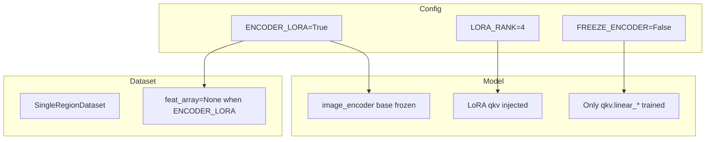

# LoRA Encoder Finetune Plan

## Background

The codebase already has full LoRA support in [model.py](eikonal_solver/model.py): when `ENCODER_LORA=True`, it freezes the base encoder, injects low-rank adapters (`_LoRA_qkv`) into ViT attention blocks, and `configure_optimizers` trains only `qkv.linear_*` params. No new packages or network surgery are needed.

## Required Changes

### 1. finetune_demo.py - TrainConfig and Logic

**Add LORA_RANK to TrainConfig** (around line 43):

```python
self.ENCODER_LORA = False
self.LORA_RANK = 4   # New: required when ENCODER_LORA=True
self.FREEZE_ENCODER = True
```

**Add CLI switch for LoRA mode** (in `parse_args`):


| Argument         | Type | Default | Purpose                               |
| ---------------- | ---- | ------- | ------------------------------------- |
| `--encoder_lora` | flag | False   | Enable LoRA encoder fine-tuning       |
| `--lora_rank`    | int  | 4       | LoRA rank when --encoder_lora is used |


When `--encoder_lora` is passed:

- Set `config.ENCODER_LORA = True`
- Set `config.LORA_RANK = args.lora_rank`
- Set `config.FREEZE_ENCODER = False` (so the external freeze block at lines 188-190 does not run; model.py already freezes the base and only LoRA params are trainable)

**External freeze block** (lines 187-190):

- Current: `if config.FREEZE_ENCODER: for p in model.image_encoder.parameters(): p.requires_grad = False`
- No change needed: with `FREEZE_ENCODER=False` in LoRA mode, this block is skipped, and model.py's LoRA logic keeps only `qkv.linear`_* trainable

### 2. SingleRegionDataset - Disable Cached Features in LoRA Mode

In [finetune_demo.py](eikonal_solver/finetune_demo.py) `SingleRegionDataset.__init`__ (lines 104-111):

- LoRA changes encoder outputs, so cached `samroad_feat_full_*.npy` is invalid.
- Add condition: if `config.ENCODER_LORA` is True, set `self.feat_array = None` even when `.npy` exists.

```python
# 3. 加载缓存特征（LoRA 模式下必须在线计算，不可用缓存）
feats = glob.glob(...)
if feats and not getattr(config, 'ENCODER_LORA', False):
    self.feat_array = np.load(feats[0])...
elif config.ENCODER_LORA:
    self.feat_array = None
    print("LoRA 模式：跳过 cached_feature，在线计算 Encoder 输出")
else:
    self.feat_array = None
```

### 3. build_dataloaders Path (Full-Dataset Training)

When `args.encoder_lora` is used with full-dataset training (not `--single_region_dir`), pass `use_cached_features=False` to `build_dataloaders` so full-dataset training also uses online encoder outputs in LoRA mode.

### 4. test_inference.py - Load LoRA Checkpoints

Inference on a LoRA-trained checkpoint requires the same structure (`ENCODER_LORA=True`, `LORA_RANK` matching training).

Add CLI args:


| Argument         | Type | Default | Purpose                                             |
| ---------------- | ---- | ------- | --------------------------------------------------- |
| `--encoder_lora` | flag | False   | Use LoRA encoder structure (for LoRA-trained ckpts) |
| `--lora_rank`    | int  | 4       | LoRA rank, must match training                      |


When `--encoder_lora` is passed, set `InferenceConfig.ENCODER_LORA=True` and `InferenceConfig.LORA_RANK=args.lora_rank` before creating the model.

### 5. run_param_sweep.sh - Optional LoRA Variant

Either:

- Add an optional `--encoder_lora` flag to the sweep script so LoRA sweeps can be run; or
- Document that users run LoRA manually with:

```bash
python eikonal_solver/finetune_demo.py --single_region_dir ... --epochs 100 --batch_size 8 --workers 4 --encoder_lora --lora_rank 4
```

Recommendation: add `ENCODER_LORA_MODE` (or similar) at the top of the sweep script to optionally enable LoRA for all runs.

## Data Flow (LoRA Mode)




## Suggested Loss Settings (from User)

Per the user's suggestions, when trying LoRA you may use:

- `ROAD_POS_WEIGHT = 20.0`
- `ROAD_DICE_WEIGHT = 0.1`
- `ROAD_DUAL_TARGET = False`

These can be exposed via CLI (e.g. `--road_pos_weight`, `--road_dice_weight`) or set as defaults when `--encoder_lora` is used. The plan does not mandate this; it is left as an optional tuning choice.

## File Summary


| File                                                                   | Action                                                                                                                                                                                        |
| ---------------------------------------------------------------------- | --------------------------------------------------------------------------------------------------------------------------------------------------------------------------------------------- |
| [eikonal_solver/finetune_demo.py](eikonal_solver/finetune_demo.py)     | Add `LORA_RANK`; add `--encoder_lora`, `--lora_rank`; apply config when flag set; fix SingleRegionDataset feat logic; pass `use_cached_features=False` when encoder_lora in full-dataset path |
| [eikonal_solver/test_inference.py](eikonal_solver/test_inference.py)   | Add `--encoder_lora`, `--lora_rank`; set InferenceConfig accordingly                                                                                                                          |
| [eikonal_solver/run_param_sweep.sh](eikonal_solver/run_param_sweep.sh) | Optional: add `ENCODER_LORA_MODE` env/var for LoRA sweep                                                                                                                                      |


## Verification

After changes:

1. LoRA train: `python eikonal_solver/finetune_demo.py --single_region_dir Gen_dataset_V2/Gen_dataset/19.940688_110.276704/00_20.021516_110.190699_3000.0 --epochs 10 --batch_size 8 --workers 4 --encoder_lora --lora_rank 4`
2. LoRA infer: `python eikonal_solver/test_inference.py --ckpt training_outputs/finetune_demo/checkpoints/best_xxx.ckpt --encoder_lora --lora_rank 4`

